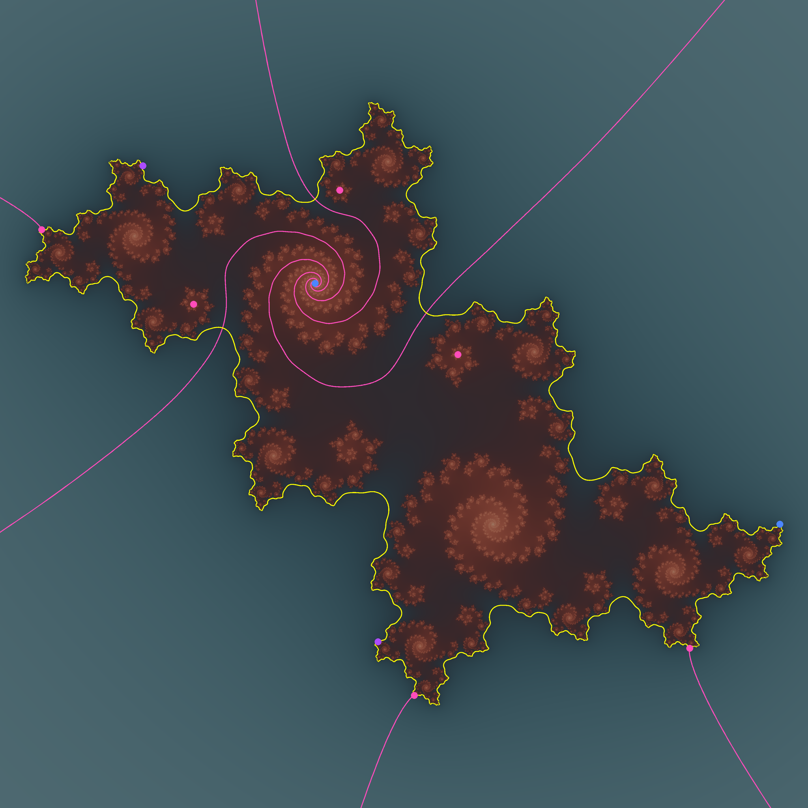

## About

A powerful tool for studying complex dynamics. Inspired heavily by the following projects:

- Wolf Jung's [Mandel](https://mndynamics.com/indexp.html) (many of whose hotkeys are intentionally reused)
- Brian and Susanna Boyd's [Dynamics Explorer](https://sourceforge.net/projects/detool/)
- Matt Noonan's [FractalStream](https://pi.math.cornell.edu/~noonan/fstream.html)

Dynamo hopes to combine the strengths of these excellent tools.

## Check out the [web demo](https://dannystoll1.github.io/dynamo/)

The web demo linked above is the most convenient way to use Dynamo,
but it is slower and is missing some features,
most notably the ability to save images.

## Features

- Over 100 built-in profiles for commonly studied dynamical systems
- Live Julia sets
- "Meta-parameter planes" (e.g. multiplier plane for Cubic Per(1, λ)) with live views of the child planes
- Live tracking for critical points and cycles
- Smooth coloring for both escaping and non-escaping components
- Period coloring
- Distance estimation
- External rays (working for quadratic polynomials and some other families, unstable in general)
- Equipotentials
- Optimized for performance

As of version 0.5.1, saved images now contain all annotations.

## Installation

To install and run, just clone the repository, navigate to `bin`, and run `cargo +nightly run -r`.

You may need to first [install Rust](https://rustup.rs/). At present, the nightly toolchain is required; you can install this with `rustup install nightly`.

Alternatively, you can download a precompiled binary from the "Releases" tags on the right.
Binaries are available for Linux, macOS, and Windows.

## Usage

### Navigation

- Z: zoom in to selection
- Ctrl-Z: zoom in far
- V: zoom out from selection
- Ctrl-V: zoom out far
- Shift-arrows: pan view
- Space: Center selection
- Shift-Space: Reset selection
- Home: Reset view and selection

### Dynamics

- F: Apply map to selection [dynamical plane]
- Ctrl-F: Find/follow parameter of given preperiod/period near selection [active plane]
- E: External ray [active plane]
- Ctrl-X or Y: External ray to point [active plane]
- Ctrl-E: Draw all rays of a given period [active plane]
- Shift-O: Draw all rays in the orbit of a given angle [active plane]
- Shift-E: Extend ray outwards from selection (works in all families where `gradient` is implemented) [active plane]
- Shift-I: Extend ray inwards (can be numerically unstable) [active plane]
- Shift-T: Extend ray bidirectionally [active plane]
- G: Equipotential [active plane]
- M: Multiplier contour (only for marked cycle curves) [active plane]

### Computation

- +: Increase max iters (x2)
- -: Decrease max iters (x1/2)
- Ctrl-S: save image (prompt in command line; currently does not include marked points/curves)
- L: Toggle Live Julia mode (update the child plane as the cursor moves in the parent plane)

### Annotations

- I: Toggle selection [active plane]
- Ctrl-\<N\>: Toggle cycles of period \<N\>, if they are implemented for the given map [dynamical plane]
- Ctrl-Shift-\<N\>: Toggle component centers of period \<N\>, if they are implemented for the given family [parameter plane]
- P: Toggle critical points [dynamical plane]
- O: Draw orbit [parameter plane]
- C: Clear orbit [dynamical plane]
- Shift-C: Clear all marked curves [active plane]

### Coloring

- R: Randomize palette
- W: White palette
- B: Black palette
- Ctrl-K: Save palette
- Ctrl-L: Load palette
- Up/Down: Change palette period
- Right/Left: Change palette phase
- 0: Internal coloration: Solid
- 1: Internal coloration: Period
- 2: Internal coloration: Period and Multiplier
- 3: Internal coloration: Multiplier
- 4: Internal coloration: Preperiod
- 5: Internal coloration: Potential of linearizing coordinate
- J: Toggle phase-based coloring for escape regions
- D: Toggle distance estimation

### User Scripts (Experimental)

Users can now write scripts at runtime to study custom dynamical systems.
Since this requires compiling code locally, [Cargo](https://rustup.rs/) is a strict dependency.
Python3 and [SymPy](https://www.sympy.org/en/index.html) are also required for the transpilation process. The latter can be installed with `pip install sympy`.

To try out this feature, navigate to the project directory and run `cargo +nightly run -rF scripting`.
This feature has been tested to work on Linux and Windows, but it remains highly experimental.

While not as flexible as manually editing profiles in Rust, scripts still allow
for a lot of expressive power with minimal boilerplate.

Example syntax:

    [metadata]
    name = "QuadRat Per(2, μ)"
    short_name = "quadrat_per_2_mu"

    [names]
    variable = "z"
    selection = "t"

    [constants]
    mu = "2-i"

    [parameters]
    a = "t^2 * (mu + mu*t - 4) / 4"
    b = "t * (mu*t - 4) / 4"

    [dynamics]
    start = 0
    map = "(z^2 + a)/(z^2 + b)"

## Planned Features

- [x] Live Julia sets
- [x] Mark orbits
- [x] Marked points
- :hammer: External rays
- [x] Equipotentials
- Saving improvements
  - [x] Save/load palettes
  - [x] Save images
    - [x] Marked points/curves in saved images
  - [ ] Save program state
  - [x] User-friendly save dialog
- [x] Menu items for most/all actions
- [ ] Command-line integration
- [x] Internal coloration
- [x] Drag to pan/zoom
- [ ] Descend to child for multi-parameter systems
- [ ] Solve for critical points and $n$-cycles automatically
- :hammer: User-friendly scripting interface
- [ ] Switch to stable channel
- [x] Implement web interface
  - [x] Fix broken clicking in web UI
  - [x] Fix slow initial rendering in web UI
